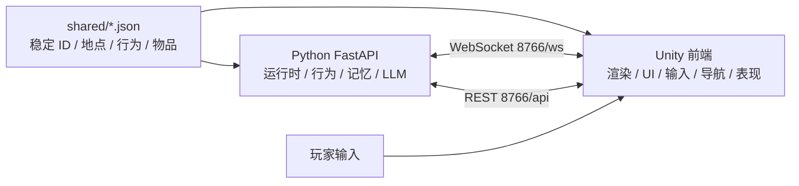
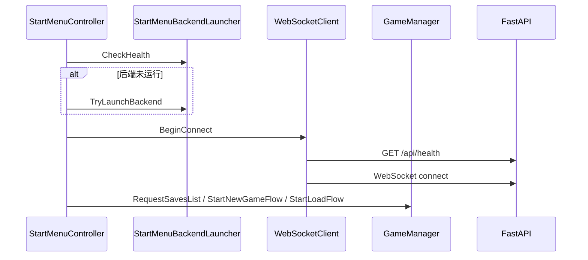
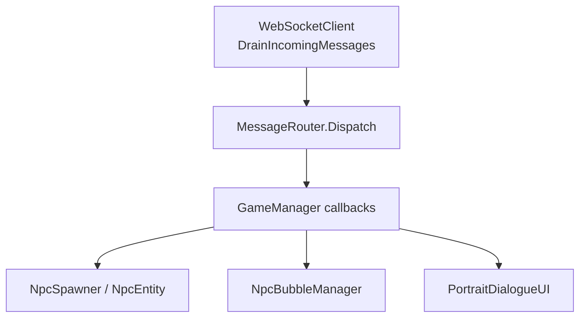
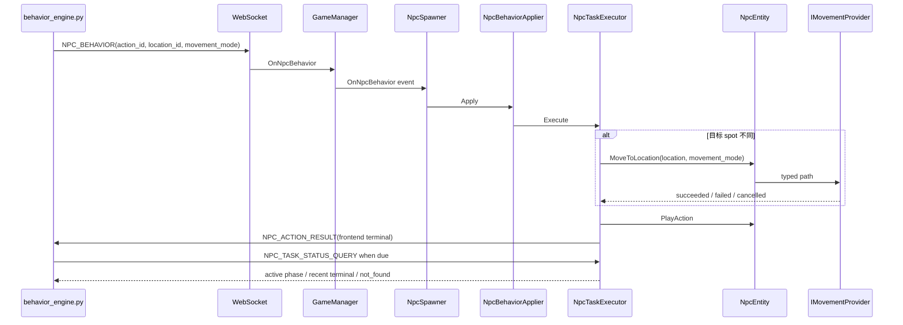
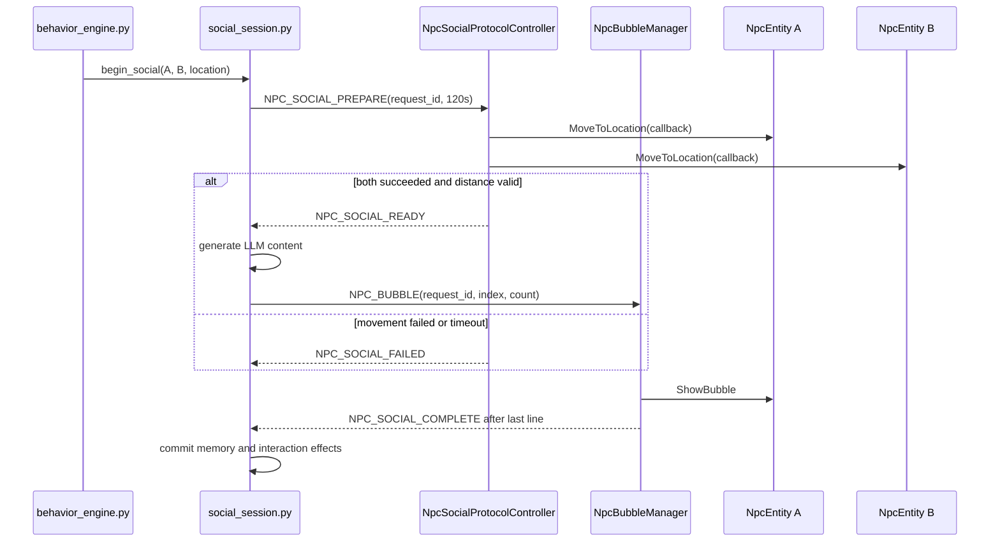
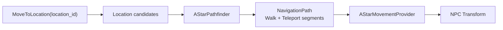
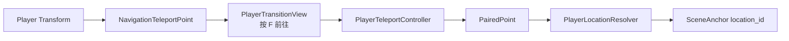

# 代码大局观

## 作用

本文是项目代码层面的总览，不替代具体设计文档和执行记录。它回答四件事：

1. 运行时主链路怎么流动
2. 前端、后端、共享配置各自负责什么
3. 高频模块之间的边界在哪里
4. 当前哪些类已经变重，后续修改应优先减重而不是继续堆功能

如果要判断当前状态，先看 `docs/Roadmap.md` 和对应 `docs/Workstreams/<功能域>/README.md`；handoff 只用于指定历史会话追溯。

## 总体架构

### 稳定 ID 规则

后端和 Unity 之间只传稳定 ID，不传自由文本地点名或行为名。

1. 地点：`shared/locations.json`
2. 行为：`shared/actions.json`
3. 物品：`shared/items.json`
4. Unity 场景落点：`SceneAnchor.LocationId`
5. NPC 正式任务：`action_id + location_id + movement_mode`；`walk_to` / `run_to` 不再是 action

## 运行时主流程

### 启动与连接

当前职责：

1. `StartMenuController` 编排开始界面流程。
2. `StartMenuBackendLauncher` 处理本机 Python 后端生命周期。
3. `WebSocketClient` 负责连接、收包、发包。
4. `GameManager` 发送开局、读档、存档等命令。

当前边界：

`GameManager` 保持 facade；命令构造已由 `GameCommandSender` 承担，状态写入已由 `GameStateStore` 承担。新增具体协议或状态不得重新塞回 facade。

### 消息分发

当前职责：

1. `WebSocketClient` 把后台线程收到的 JSON 排回主线程。
2. `MessageRouter` 用 `type` 反序列化到强类型消息。
3. `GameManager` 注册 callbacks，并转成 Unity 事件。
4. 各表现层脚本订阅 `GameManager` 事件或 `WS.Callbacks`。

当前边界：

正式 NPC 任务、节点询问和行为终态通过 `GameManager` 事件转发；NPC-NPC 社交由 `NpcSocialProtocolController` 执行 PREPARE 会合协议，气泡轮播由 `NpcBubbleManager` 处理，不与正式任务状态机合并。

## 前端模块边界

### Core

目标职责：

1. 连接后端
2. 分发协议消息
3. 持有轻量运行状态
4. 暴露前端命令入口

主要文件：

1. `Assets/Scripts/Core/GameManager.cs`
2. `Assets/Scripts/Core/WebSocketClient.cs`
3. `Assets/Scripts/Core/PlayerController.cs`
4. `Assets/Scripts/Core/StartMenuController.cs`
5. `Assets/Scripts/Core/StartMenuBackendLauncher.cs`

当前边界：

1. `GameManager`：只做 facade 和高层事件。
2. `GameStateStore`：承接时间、玩家位置、NPC 状态。
3. `GameCommandSender`：承接协议命令生成和发送。
4. `DialogueSessionController`：后续承接玩家正式对话生命周期。

### NPC

目标职责：

1. 生成 NPC 实例
2. 管理 NPC 注册表
3. 执行后端行为意图
4. 维护 NPC 本地表现状态

主要文件：

1. `Assets/Scripts/NPC/NpcSpawner.cs`
2. `Assets/Scripts/NPC/NpcEntity.cs`
3. `Assets/Scripts/NPC/NpcBehaviorApplier.cs`
4. `Assets/Scripts/NPC/NpcTaskExecutor.cs`
5. `Assets/Scripts/NPC/IMovementProvider.cs`

当前边界：

1. `NpcSpawner`：只生成、注册、查找。
2. `NpcBehaviorApplier`：行为消息薄适配，不维护任务生命周期。
3. `NpcTaskExecutor`：维护 validating / moving / performing / terminal 阶段，并响应状态询问。
4. `NpcEntity`：保留身份、显示、气泡、walk/run 移动入口和当前确认位置。
5. `NpcEntity.CurrentLocation`：只在导航确认到达后更新。
6. Unity 前端是任务成功权威；后端只能询问阶段和做失联硬超时兜底。

### Navigation

目标职责：

1. 场景语义位置转候选点
2. 静态网格寻路
3. 保留传送边语义
4. 执行路径表现
5. 提供调试覆盖和日志

主要文件：

1. `Assets/Scripts/Data/SceneAnchor.cs`
2. `Assets/Scripts/Data/SceneAnchorRegistry.cs`
3. `Assets/Scripts/Data/LocationDatabase.cs`
4. `Assets/Scripts/Navigation/NavigationGridAsset.cs`
5. `Assets/Scripts/Navigation/AStarPathfinder.cs`
6. `Assets/Scripts/Navigation/AStarMovementProvider.cs`
7. `Assets/Scripts/Navigation/NavigationGridSpriteBaker.cs`
8. `Assets/Scripts/Navigation/NavigationGridOverlay.cs`
9. `Assets/Scripts/Navigation/NavigationTeleportPoint.cs`
10. `Assets/Scripts/Navigation/PlayerTeleportController.cs`
11. `Assets/Scripts/Navigation/PlayerLocationResolver.cs`
12. `Assets/Scripts/UI/PlayerTransitionView.cs`

当前边界：

1. `NavigationTeleportLink`：决定自己的触发半径、入口匹配半径、出口匹配半径、成本和双向规则。
2. `AStarPathfinder`：输出 typed path，保留 `Walk` / `Teleport` segment。
3. `AStarMovementProvider`：只执行 typed path，不反推传送。
4. `NavigationDebugLog`：集中输出导航诊断。
5. `PlayerTeleportController`：只处理玩家入口选择、F 输入与传送，不复用 NPC 自动寻路执行器。
6. `PlayerLocationResolver`：统一解析并同步玩家 `location_id`。
7. `PlayerTransitionView`：只驱动资产层“按 F 前往”提示。

NPC typed path 与玩家场景入口的关键 Play 回归均已完成。后续只考虑拆 location candidate planner 和为新场景配置入口，不重新打开 typed path 或坐标反推传送方案。

### Dialogue

目标职责：

1. 玩家正式对话 UI
2. NPC 世界气泡显示
3. NPC-NPC 社交气泡排队
4. 对话期间输入和移动锁协调

主要文件：

1. `Assets/Scripts/Dialogue/PortraitDialogueUI.cs`
2. `Assets/Scripts/Dialogue/NpcBubbleManager.cs`
3. `Assets/Scripts/Dialogue/NpcSocialRendezvousController.cs`
4. `Assets/Scripts/Dialogue/NpcSocialProtocolController.cs`
5. `Assets/Scripts/Dialogue/BubbleUI.cs`
6. `Assets/Scripts/Dialogue/NpcPortraitData.cs`
7. `Assets/Scripts/Dialogue/LocationBackgroundData.cs`

当前边界：

1. `NpcBubbleManager`：只负责气泡队列和显示。
2. `NpcSocialProtocolController`：负责 `PREPARE -> READY / FAILED -> COMPLETE` 会话终态和 120 秒会合监督。
3. `NpcSocialRendezvousController`：只负责双方距离判断和气泡播放期间的移动锁。
4. 正式 NPC 任务由 `NpcTaskExecutor` 处理，不与社交协议状态机合并。

## 后端模块边界

### 后端入口与运行时

主要文件：

1. `backend/src/main.py`
2. `backend/src/application/runtime.py`

目标职责：

1. FastAPI / WebSocket 服务入口
2. 游戏运行时装配
3. 消息总线和各子系统接线

### NPC 行为与状态

主要文件：

1. `backend/src/npc/behavior_engine.py`
2. `backend/src/npc/state_manager.py`
3. `backend/src/npc/task_catalog.py`
4. `backend/src/npc/task_tracker.py`
5. `backend/src/world/proximity.py`

目标职责：

1. 白天行为决策
2. NPC 状态漂移
3. NPC-NPC 社交候选筛选
4. location zone 语义判断
5. action-location-role affordance 与合法计划候选
6. 前端任务阶段询问、进展停滞与较长硬超时

重要边界：

后端的同区域社交是语义层判断，不等于 Unity 物理距离。Unity 必须仍然负责物理靠近和气泡显示条件。

### 对话与感知

主要文件：

1. `backend/src/dialogue/prompt_builder.py`
2. `backend/src/dialogue/perception_context.py`
3. `backend/src/npc/npc_dialogue.py`

目标职责：

1. Prompt 组装
2. 现场感知注入
3. 玩家-NPC / NPC-NPC 对话生成

### 记忆系统

主要文件：

1. `backend/src/memory/manager.py`
2. `backend/src/memory/retrieval.py`
3. `backend/src/memory/embedding.py`
4. `backend/src/memory/evolution.py`
5. `backend/src/database/sqlite_client.py`
6. `backend/src/database/lancedb_client.py`

当前口径：

1. SQLite 图层保存节点 ID、边和 clarity。
2. 向量层保存节点内容、embedding、importance、created_day、archived。
3. 近期遗忘机制是 clarity 衰减 + archived 归档。

## 关键数据流

### NPC 行为落地

当前剩余：

1. 动作完成目前仍使用等待时长，后续接真实动画 / 交互完成事件。
2. 后端已有一次重发，尚缺替代 spot 和按失败原因重新规划。
3. 营业状态、精确时间窗和动态 spot 占用尚未进入 affordance。

### NPC-NPC 社交

当前边界：Unity 是物理会合与播放终态权威；Python 只在 READY 后生成内容、只在 COMPLETE 后写记忆。旧 `NPC_SOCIAL_ACTION` 仅保留兼容，不是默认链路。

### 导航传送

目标流程应该是：

当前实现已经使用 typed path；`AStarMovementProvider` 只执行 `Walk / Teleport` segment，不再根据坐标反推传送。

玩家传送已在 `Town_Main` 完成，流程为：

玩家与 NPC 共享传送点和地点语义，但玩家不进入 `AStarMovementProvider`。当前场景 16 个端点、提示显隐、配对出口位移和传送后地点同步已完成验证。

## 当前过重类清单

### `GameManager`

当前仍承担：

1. 单例 facade
2. WebSocket callback 注册
3. 对话 UI facade 调用
4. 事件分发

本地状态和协议命令已分别拆到 `GameStateStore` / `GameCommandSender`。后续新增对话生命周期状态时优先拆 `DialogueSessionController`。

### `AStarMovementProvider`

当前承担：

1. location 候选点选择
2. 起点吸附
3. A* 调用
4. 路径执行
5. typed path 执行
6. 失败结果回报

typed path 和 `NavigationDebugLog` 已落地。后续如继续减重，只拆 location candidate planner。

### `NpcBubbleManager`

当前承担：

1. 气泡排队
2. 气泡显示

社交动作、靠近等待和移动锁已拆到 `NpcSocialRendezvousController`，不再把新移动策略加回气泡管理器。

### `PortraitDialogueUI`

已经承担：

1. 立绘显示
2. 背景切换
3. token 打字机
4. 玩家输入
5. 快捷回复按钮
6. 加载动画

当前可暂缓拆分。后续若继续加对话 UI 状态，优先拆 view model 或子组件。

## 新功能进入规则

### 先问三个问题

1. 这是协议 / 状态 / 表现 / 资产 / 导航 / UI 中哪一层？
2. 现有类是否已经承担多个职责？
3. 新功能是否需要一个可替换接口或数据结构，而不是直接写进 MonoBehaviour？

### 不应继续追加的方向

1. 不要继续向 `AStarMovementProvider` 增加传送规则。
2. 不要继续向 `GameManager` 增加具体 UI 操作。
3. 不要继续让 `NpcBubbleManager` 承担更多移动策略。
4. 不要让后端自由生成 Unity 不认识的地点或行为。

### 推荐新增位置

1. 新协议命令：进入 `GameCommandSender`，不要回到 `GameManager` 拼接。
2. 新 NPC 正式任务阶段：进入 `NpcTaskExecutor`；`NpcBehaviorApplier` 保持薄适配。
3. 新导航规则：优先放在 `NavigationGridAsset` / `NavigationTeleportLink` / `AStarPathfinder`。
4. 新社交靠近规则：进入 `NpcSocialRendezvousController`，不要塞进气泡层或正式任务执行器。
5. 新场景位置：先配 `SceneAnchor`，再考虑 fallback JSON。

## 必读链路

新会话处理前端结构问题时，建议按顺序阅读：

1. `docs/ProjectIndex.md`
2. `docs/Roadmap.md`
3. `docs/Workstreams/FrontendArchitecture/README.md`
4. `docs/DesignDocs/CodebaseBigPicture.md`
5. 目标代码目录的 `README.md`
6. 只有追溯原因时，按主题搜索相关 `docs/AIChanges/<功能域>/` 记录

处理导航问题时额外阅读：

1. `docs/Workstreams/Navigation/README.md`
2. `docs/DecisionRecords/ADR-0002-navigation-typed-path.md`
3. `docs/AIChanges/FrontendArchitecture/2026-07-12_前端职责框架整改_plan.md`
4. `docs/AIChanges/Navigation/2026-07-12_NPC导航反直觉修正_execution.md`
5. `Assets/Scripts/Navigation/AStarPathfinder.cs`
6. `Assets/Scripts/Navigation/AStarMovementProvider.cs`
7. `Assets/Scripts/Navigation/NavigationGridAsset.cs`
